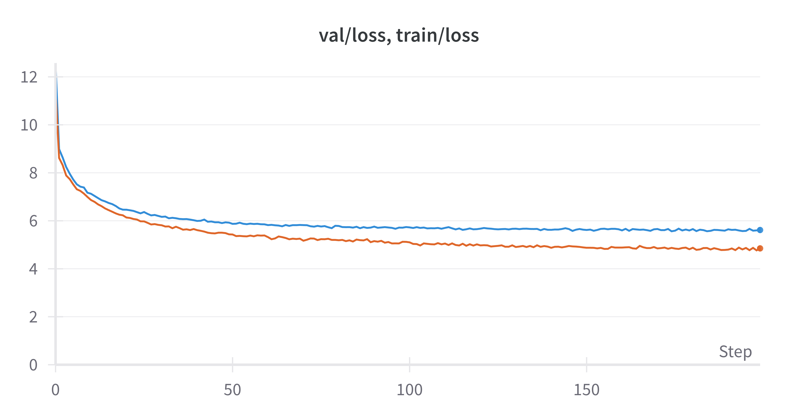
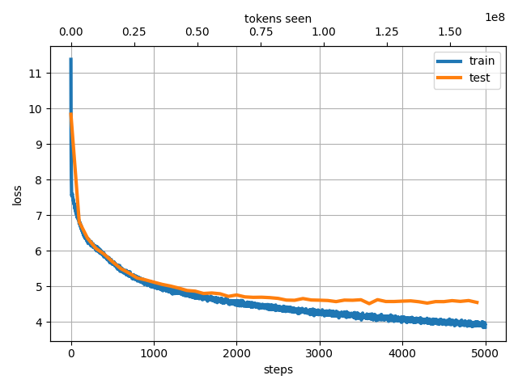

# jax-llm
JAX implementation of Large Language Models.
You can train GPT-2-like models with 青空文庫 ([aozora bunko-clean](https://huggingface.co/datasets/globis-university/aozorabunko-clean) dataset) or any other text dataset.
Model implementation is based on [NanoLM](https://optax.readthedocs.io/en/latest/_collections/examples/nanolm.html).

## How to use

###  Prepare the [aozora bunko-clean](https://huggingface.co/datasets/globis-university/aozorabunko-clean) dataset.

```bash
python3 src/jax_llm/prepare_aozora.py --book_num 10246
```
This command generates a single text file. We use 10246 books (80M Tokens).

> [!NOTE]
> You can use any dataset for training by simply preparing a suitable txt file, without executing this command. For example, [Wikitext-JA](http://www.lsta.media.kyoto-u.ac.jp/resource/data/wikitext-ja) is a good choice.

###  Train the BPE (Byte Pair Encoding) tokenizer.
Specify the path to the text file created in the previous step.
```bash
python3 src/jax_llm/train_tokenizer.py --data_name "aozora_10246"
```

###  Train the NanoLM model with aozora bunko-clean dataset.

```bash
python3 src/jax_llm/train.py --data_name "aozora_10246" --batch_size 256 --n_iterations 20000 --n_freq_eval 100 --dropout_rate 0.0 --learning_rate 0.001 --num_layers 12 --embed_size 512  --head_size 64 --num_heads 8 --block_size 128 --wandb_log True
```
This command takes about one hour with a single GPU (A100).
If you don't have a GPU, you can scale down the model size by reducing the dataset size and the model size.


### Generate text with the trained model.
```bash
$ python3 src/jax_llm/generate.py --prompt "国境の長いトンネルを抜けると雪国であった。" --data_name "aozora_10246" --max_new_tokens 200
```

### Results
The model size is 80M parameters.

- aozora_10246 (80M Tokens).

*Loss Dynamics*


*Prompt: "国境の長いトンネルを抜けると雪国であった。"*
> Output: 国境 の長い トンネル を抜 けると 雪 国 であった 。 この あたりは 、 一 冬 に 満た ねばならなかった 。 そして 、 その 冬 枯 の 季節 、 冬の 日は 、 その 季節 、 冬 の間 、 寒 の 季節 に 、 大 気の 冷 える 夜 だった 。 「 あ 、 そうだ 。 たしかに 」 と 、 半七は 笑っていた 。「 だが 、 そんな 訳 でもない 。 あの 時に 、 私は 、 あの 、 お 邸 のお 女中 さん ―― と 、 お 名は 、 若い 妓 と 、 妓 の 吉 次 とが 、 その 枕 元から 取り 交 している 。 しかし 、 彼女は 、 その 母 に向って それを 否定 しようと 努 めなかった 。 そうして 、 その 反 感を 、 どう 解釈 して よいか 、 また 、 自分の 力で それに 従 うべき かを 、 自分で はっきり 知って いながら でも 、 やはり 自分を 信じ なければならない 。 それは 、 自分の 知らない うちに 、 自分の 過去の 記憶 で 、 この 小説 の中に 残っている 「 昔 の人 」 には 一種の ロマン が 含まれている 。 だが 、 そこには 何か こう 神秘的な 力が 潜んでいる 。 それは 、 私が この 眼で 見た 、 最も 純粋な 、 また 同時に 美しい ―― それは 、 その 創造 した 芸術 の美しさ である 。 そして 、 そこに 一つの 現実 への 飛躍 がある


## Data Parallelism
You can train the model with multiple GPUs using data parallelism.
```bash
python3 src/jax_llm/train_data_parallel.py --data_name "aozora_10246" --batch_size 128 --n_iterations 5000 --n_freq_eval 100 --dropout_rate 0.1 --learning_rate 0.001 --num_layers 12 --embed_size 512  --head_size 64 --num_heads 8 --block_size 256 --n_devices 2
```
Using 2 GPUs with the same settings as in the previous example reduces the training time by about 1.5 times compared to using a single GPU. You can get a similar loss dynamics as the single GPU case.

## Projects Using jax-llm
- [input-method](https://github.com/speed1313/input-method): First-two-char input method using transformer-based language model and n-gram model.


## References
Special thanks to the following repositories, papers, and datasets.
- https://optax.readthedocs.io/en/latest/_collections/examples/nanolm.html
- https://github.com/rasbt/LLMs-from-scratch
- https://github.com/karpathy/nanoGPT
- https://github.com/openai/gpt-2
- [Radford et al., Language Models are Unsupervised Multitask Learners, 2019](https://d4mucfpksywv.cloudfront.net/better-language-models/language-models.pdf)
- https://github.com/lxaw/shijin
### Dataset
- [akeyhero, aozora bunko-clean](https://huggingface.co/datasets/globis-university/aozorabunko-clean)
  青空文庫, https://www.aozora.gr.jp/
- [Mori et al., Wikitext-JA](http://www.lsta.media.kyoto-u.ac.jp/resource/data/wikitext-ja)

- [Tsukagoshi et al., WikiSplit++](https://huggingface.co/datasets/cl-nagoya/wikisplit-pp)


## Appendix


## Training with [WikiSplit++](https://huggingface.co/datasets/cl-nagoya/wikisplit-pp) dataset.
###  Prepare the WikiSplit++ dataset.

We construct input.txt by concatenating the `simple_reversed` (or any other) fields from the train dataset with `<|endoftext|>` as a separator.
```bash
python3 src/jax_llm/prepare_wikisplit-pp.py --field "simple_reversed"
```

- Substitute "aozora_10246" with "wikisplit-pp" in the commands in the `How to use` section.

### Results
- wikisplit-pp-simple_reversed (20M Tokens)

*Loss Dynamics*


*Prompt: "The train came out of the long tunnel into the snow country."*
> Output: The train came out of the long tunnel into the snow country . In the 1970s a pedestrian was also used . However , it was widely viewed as an alternative to the American film industry . The original " Superman III " was based on the first game in series . However , he is a good friend for the character , and is reluctant to let anyone out of school . A year later the station began operation in the late 1980s , but in late 2002 to be converted to DVD . As a result , " The Voice " had some of the first international albums . He is a long - time contributor to the " New York Times ". The Daily Telegraph is an imprint of the American National Media Enterprise Association . She studied literature and art history . She was an undergraduate in the classical languages of Germany and the Austrian - Polish language . Born in the southern German region of the Czech state of the Kingdom of Hungary . The most extensive was the United States ' s entry in the 1960s , where the U . S . Supreme Court is being investigated . The
