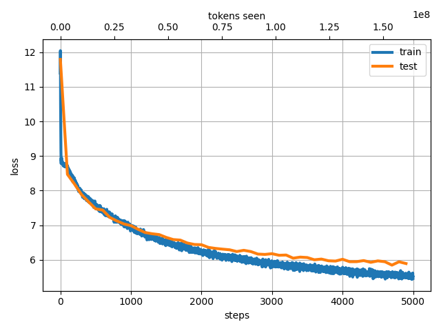
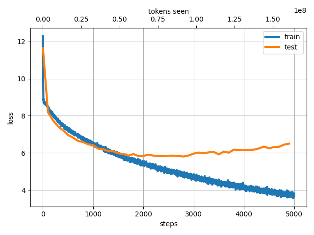
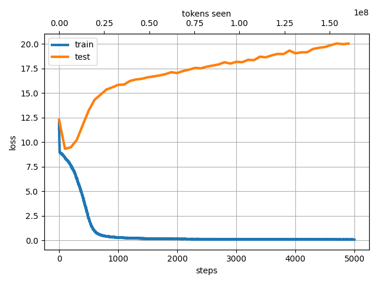

# jax-llm
JAX implementation of Large Language Models.
You can train GPT-2-like models with 青空文庫 ([aozora bunko-clean](https://huggingface.co/datasets/globis-university/aozorabunko-clean) dataset) or any other text dataset.
Model implementation is based on [NanoLM](https://optax.readthedocs.io/en/latest/_collections/examples/nanolm.html).

## How to use

###  Prepare the [aozora bunko-clean](https://huggingface.co/datasets/globis-university/aozorabunko-clean) dataset.

```bash
python3 src/jax_llm/prepare_aozora.py --book_num 10246
```
This command generates a single text file. We use 10246 books (80M Tokens).

> [!NOTE]
> You can use any dataset for training by simply preparing a suitable txt file, without executing this command. For example, [Wikitext-JA](http://www.lsta.media.kyoto-u.ac.jp/resource/data/wikitext-ja) is a good choice.

###  Train the BPE (Byte Pair Encoding) tokenizer.
Specify the path to the text file created in the previous step. This process takes approximately 20 seconds.
```bash
python3 src/jax_llm/train_tokenizer.py --data_name "aozora_10246"
```

###  Train the NanoLM model with aozora bunko-clean dataset.

```bash
python3 src/jax_llm/train.py --data_name "aozora_10246" --batch_size 128 --n_iterations 5000 --n_freq_eval 100 --dropout_rate 0.1 --learning_rate 0.001 --num_layers 12 --embed_size 512  --head_size 64 --num_heads 8 --block_size 256
```
This command takes about 20 miniutes with a single GPU (A100).
If you don't have a GPU, you can scale down the model size by reducing the dataset size and the model size.


### Generate text with the trained model.
```bash
$ python3 src/jax_llm/generate.py --prompt "国境の 長いトンネルを抜けると雪国であった。" --data_name "aozora_10246" --max_new_tokens 200
```

### Results
Only the number of books is changed in the following examples. The other settings are the same (--batch_size 128 --n_iterations 5000 --n_freq_eval 100 --dropout_rate 0.1 --learning_rate 0.001 --num_layers 12 --embed_size 512  --head_size 64 --num_heads 8 --block_size 256) and the model size is 70M parameters.

- aozora_10246 (80M Tokens).

Loss Dynamics:


Prompt: "国境の 長いトンネルを抜けると雪国であった。":

> Output: 国境 の長い トンネル を抜 けると 雪 国 であった 。 「 オヤ 、 この 寒い ところ 、 こんなに 早くから 寒 気が する 。 それでも 、 その 熱 湯 は 湯 から 上って 来る 。 そうして 、 小 川は 、 「 どうした もんだ ッ 。 この 石 置き 場の 石 地蔵 へ 、 この 小屋 へと 、 と まって 、 お とし 穴 の上 におし こめられて しまいました 。 お しまいに 、 お へや から 、 お 位牌 や 、 位牌 や 、 お 位牌 と一緒に 、 お 線香 を持って 、 お 線香 を持って 帰って来た ら 、 お 涌 が 帰って くれ と云 いたい ことがある 。 お 涌 さんの ことは 、 もう とっくに 承知 していた のでございます 。」 と 、 彼女は いいました 。 娘は 、 彼女の 頭を じっと 握り 開いて 、 「 私は もう 死んだ 方が ええ ですから 」 彼女は 、 そう 云うと 、 「 いや 、 そんなこと ばかり 。 お前 はお 祖父 さんと 一緒 に出 掛けて 、 それから お 妾 、 又 、 お 婿 様 をお 連れ 申 したい 」 「 はい 。 どうぞ 」 「 はい 、 はい 」 と 、 小 女が 小 男に いった 。 「 この 娘を 、 どう 思って いい かわからない ね 」 「 はい 、 あの 通りの 、 お 二人が 、 その 、 小 太郎の


- aozora_1000 (8M Tokens).

Loss Dynamics:


Prompt: "国境の 長いトンネルを抜けると雪国であった。"

> Output: 国境 の 長い トンネルを 抜けると 雪 国 であった 。 この 赤 土が 、 地上に 出ている のが 、 だんだん 、 ひど くなって 、 ものすごく 静まり返 っていた 。 「 茂ちゃん 、 いい子 だよ 。 その目は 死んで やしない 。 もし 、 この 窓から 、 あの人を 動かす ことができた としても 、 あの 幻 影が 、 だんだん 白く 透いて 行く 。 が 、 また 、 お 組が 、 お 参り になる わ 。） と 、 独言を いいながら 手を取って 、 しばらくして 、 衝と 柄杓 で 吹 出すように 、 ドンと 擡げて 、 「 ええ 、 貴方 、 まあ 、 もう 、 お 草臥 れの 入った のが 、 あの 、 その 風説 を済 ました のですが 。 いや 、 その 行方が 知りたい のですが 、 それは 、 きっと 私の 見た こと ではなくて 、 あなたが 、 殺人の 錯誤 だとは 考えられません 。 例えば 、 この 花瓶 だとか 、 花瓶 だとか 、 石膏 色 だとか 、 石膏 色に ふさわ しく 見える 。 そういう 、 べら 棒な 話がある だろうか 。 さて 、 その 興行 主の 奈落 へ 、 一 封 を襲 わ ねばなりません 。 その 願 、 行 先は 、 まだ 完全 ではない のだから 駄目だ 」 「 ねえ 、 やっぱり それは 困る じゃないか 」 「 ああ 、 それは そうだ 。 とにかく 僕が やって来た まえ 」 「 それは 、 僕の 母親 さ 」 「 さあ


- aozora_100 (0.3M Tokens)

Loss Dynamics:


Prompt: "国境の 長いトンネルを抜けると雪国であった。"
> Output: 国境 の 長い トンネル を抜 けると 雪 国 であった 。 しかも 一枚の 開化 からね 。」 「 それは君の 引っ 切り 、 この じゃないか ？」 Ｈさんは Ｍ に答える 前にもう 笑い声を 洩らしていた 。 「 幽霊 じゃ なかったんです 。 しかし 幽霊が出るって言ったのは 磯 っ臭い 山 のかげ の卵 塔 場 でした し 、 おまけに そのまた ながらみ取りの 死骸は 蝦 だらけになって 上った もんですから 、 誰でも 始めのうちは 真に 受け なかった にしろ 、 気味悪 がっていた ことだけは 確かな んです 。 そのうちに 海軍の 兵 曹 上りの 男が 宵のうち から 卵 塔 場に 張り こんで いて 、 とうとう 幽霊 を見 とど けた んですがね 。 とっ つかまえて 見りゃ 何の ことはない 。 ただその ながらみ 取 りと 夫婦 約束 をしていた この町の達磨茶屋の 女だった んです 。 それでも 一時は 火が 燃える の人 を 呼ぶ 声が聞える のって 、 ずいぶん 大騒ぎ をした もんですよ 。」 「 じゃ 別段 その女は 人を 嚇 かす 気で 来ていた んじゃない の ？」 「 ええ 、 ただ 毎晩 十二時 前後 にな がら み 取りの 墓 の前へ 来ちゃ 、 ぼんやり 立っていた だけ なんです 。」 Ｎさん の話は こう言う 海辺に いかにも ふさわしい 喜劇 だった 。 が 、 誰も 笑う ものはなかった 。 のみならず 皆 なぜ ともなしに 黙って 足 ばかり 運んでいた 。 「 さあ この辺 から 引っ 返す かな 。」 僕等は Ｍの こう言った時 、 いつのまにか もう 風の落ちた 、 静かな 姿が 後に 来ない わ 。 が 、 女は 無言のまま 会釈 をして 、 自分も 連


When the model size is fixed, if the number of tokens is small, the train loss and eval loss diverge. However, when the number of tokens is large, both the train loss and eval loss decrease together.
This result illustrates a part of the findings pointed out in the [Kaplan et al., Scaling Laws for Neural Language Models, 2020](https://arxiv.org/abs/2001.08361).
It is interesting to see such results even in a smaller setting.


## Training with [Wikitext-JA](http://www.lsta.media.kyoto-u.ac.jp/resource/data/wikitext-ja) dataset.
###  Prepare the Wikitext-JA dataset.
- Download the dataset from [here](http://www.lsta.media.kyoto-u.ac.jp/resource/data/wikitext-ja).
```bash
python3 src/jax_llm/prepare_wiki_ja_featured.py
```
- Substitute "aozora_10246" with "wiki-ja-featured" in the commands in the `How to use` section.


## References
Special thanks to the following repositories, papers, and datasets.
- https://optax.readthedocs.io/en/latest/_collections/examples/nanolm.html
- https://github.com/rasbt/LLMs-from-scratch
- https://github.com/karpathy/nanoGPT
- https://github.com/openai/gpt-2
- [Radford et al., Language Models are Unsupervised Multitask Learners, 2019](https://d4mucfpksywv.cloudfront.net/better-language-models/language-models.pdf)
- https://github.com/lxaw/shijin
- [Kaplan et al., Scaling Laws for Neural Language Models, 2020](https://arxiv.org/abs/2001.08361)
### Dataset
- akeyhero, https://qiita.com/akeyhero/items/b53eae1c0bc4d54e321f
- [akeyhero, aozora bunko-clean](https://huggingface.co/datasets/globis-university/aozorabunko-clean)
  青空文庫, https://www.aozora.gr.jp/
- [Wikitext-JA](http://www.lsta.media.kyoto-u.ac.jp/resource/data/wikitext-ja)