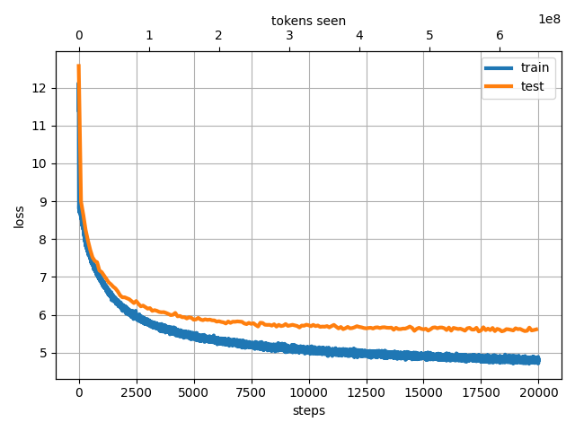

# jax-llm
JAX implementation of Large Language Models.
You can train GPT-2-like models with 青空文庫 ([aozora bunko-clean](https://huggingface.co/datasets/globis-university/aozorabunko-clean) dataset) or any other text dataset.
Model implementation is based on [NanoLM](https://optax.readthedocs.io/en/latest/_collections/examples/nanolm.html).

## How to use

###  Prepare the [aozora bunko-clean](https://huggingface.co/datasets/globis-university/aozorabunko-clean) dataset.

```bash
python3 src/jax_llm/prepare_aozora.py --book_num 10246
```
This command generates a single text file. We use 10246 books (80M Tokens).

> [!NOTE]
> You can use any dataset for training by simply preparing a suitable txt file, without executing this command. For example, [Wikitext-JA](http://www.lsta.media.kyoto-u.ac.jp/resource/data/wikitext-ja) is a good choice.

###  Train the BPE (Byte Pair Encoding) tokenizer.
Specify the path to the text file created in the previous step. This process takes approximately 20 seconds.
```bash
python3 src/jax_llm/train_tokenizer.py --data_name "aozora_10246"
```

###  Train the NanoLM model with aozora bunko-clean dataset.

```bash
python3 src/jax_llm/train.py --data_name "aozora_10246" --batch_size 128 --n_iterations 5000 --n_freq_eval 100 --dropout_rate 0.1 --learning_rate 0.001 --num_layers 12 --embed_size 512  --head_size 64 --num_heads 8 --block_size 256
```
This command takes about 20 miniutes with a single GPU (A100).
If you don't have a GPU, you can scale down the model size by reducing the dataset size and the model size.


### Generate text with the trained model.
```bash
$ python3 src/jax_llm/generate.py --prompt "国境の長いトンネルを抜けると雪国であった。" --data_name "aozora_10246" --max_new_tokens 200
```

### Results
Only the number of books is changed in the following examples. The other settings are the same (--batch_size 128 --n_iterations 5000 --n_freq_eval 100 --dropout_rate 0.1 --learning_rate 0.001 --num_layers 12 --embed_size 512  --head_size 64 --num_heads 8 --block_size 256) and the model size is 70M parameters.

- aozora_10246 (80M Tokens).

*Loss Dynamics*


*Prompt: "国境の長いトンネルを抜けると雪国であった。"*
> Output: 国境 の長い トンネル を抜 けると 雪 国 であった 。 「 オヤ 、 この 寒い ところ 、 こんなに 早くから 寒 気が する 。 それでも 、 その 熱 湯 は 湯 から 上って 来る 。 そうして 、 小 川は 、 「 どうした もんだ ッ 。 この 石 置き 場の 石 地蔵 へ 、 この 小屋 へと 、 と まって 、 お とし 穴 の上 におし こめられて しまいました 。 お しまいに 、 お へや から 、 お 位牌 や 、 位牌 や 、 お 位牌 と一緒に 、 お 線香 を持って 、 お 線香 を持って 帰って来た ら 、 お 涌 が 帰って くれ と云 いたい ことがある 。 お 涌 さんの ことは 、 もう とっくに 承知 していた のでございます 。」 と 、 彼女は いいました 。 娘は 、 彼女の 頭を じっと 握り 開いて 、 「 私は もう 死んだ 方が ええ ですから 」 彼女は 、 そう 云うと 、 「 いや 、 そんなこと ばかり 。 お前 はお 祖父 さんと 一緒 に出 掛けて 、 それから お 妾 、 又 、 お 婿 様 をお 連れ 申 したい 」 「 はい 。 どうぞ 」 「 はい 、 はい 」 と 、 小 女が 小 男に いった 。 「 この 娘を 、 どう 思って いい かわからない ね 」 「 はい 、 あの 通りの 、 お 二人が 、 その 、 小 太郎の

- aozora_1000 (8M Tokens).

*Loss Dynamics*


*Prompt: "国境の長いトンネルを抜けると雪国であった。"*
> Output: 国境 の長い トンネルを 抜けると 雪 国 であった 。 この 赤 鬼が 、 この 怪物は 、 どんな 身分 、 魔術師 のような 、 みにくい もの まで だま されたり するのです 。 でも 、 もし 私達が 抱き しめて しまっても 、 もう 何の 気も つかず 、 その 事が 気 恥かしく 、 「 不 十分 と だ 、 この 次は 、 ちゃんと 持っている 、 お 笑い なさる がいい 。 お 止し 下さい 。」 「 ああ 、 あの 子が 、 まあ 、 お 顔を なすった 時 、 御 返事 で 。」 「 はい 。」 「 まあ 可 かん 。 私は 、 あの 、 芸妓 は 、 また 、 あの 、 の 裸 になって 、 生きて ゆく という のだろう 。 あの 、 あの 場合 とは 、 まだ 、 まだ 怪しむ かぎり 、 もう 、 わしの 姿 や 、 よく 見ている ことは 、 たいへん 考え ぶかい ものでした 。 それに 、 お しゃべ りの やわら かな が 、 たちまち 、 だんだん ひろがって 、 とうとう しまいには 、 青い 絹の 着物を着て 、 それを 着て 、 小さな 寝床 の 電燈 などを 、 ぼんやりと 照らしている 。 「 君 。 君 、 君は あの 二階に 居た 。 なぜ そんなに いやな 魔 体 がある だろうか 」 そういって 僕は 思わず 四宮 理学士が 顔を 前に 向けた 。 「 あら 、 何でしょう 、 母様 ……」 と 、

- aozora_100 (0.3M Tokens)

*Loss Dynamics*


*Prompt: "国境の長いトンネルを抜けると雪国であった。"*
> Output: 国境 の長い トンネル を抜 けると 雪 国 であった 。 しかも 一枚の 開化 べ った ときでも 、 何も言わずに 楢山夫人 や 、 貧乏 ですが 、……」 「 なぜ 歩いて行かない んだ ？ 僕などは どこまでも歩いて行きた くなれば 、 どこまでも 歩いて行く ことにしている 。」 「 それは 余り ロマンティック だ 。」 「 ロマンティック なのが どこ が悪い ？ 歩いて 行きたい と思いながら 、 歩いて行かない のは 意気地なし ばかりだ 。 凍 死 しても 何でも 歩いて見ろ 。……」 彼は突然 口調 を変え Bro ther と僕に声をかけた 。 「 僕は きのう 本 国の 政府 へ 従軍 したい と云う 電報を打った んだよ 。」 「 それで ？」 「 四日 から 、 造作 はありません 。 東京の 川や 掘割 りは 河童 には 往来 も同様 ですから 。」 僕は 河童も 蛙のように 水 陸 両 棲 の 動物 だったことに 今さらのように 気がつきました 。 「 しかしこの 辺 には 川 はない がね 。」 「 ははあ 、 あれは 理論 がこの 考 を嫌 ったので 、 引 力にしても 斥 力にしても 、 相離れた所から 作用を及ぼ すように 見えても 、 実際は 中間に 在る 媒介物の 内に 起る 作用 の結果が 、 この 形で 現われる ものだ という 風に 考えた 。 ファラデー自身が 前に 発見した 電磁気廻転 につきて 研究 で 、 復氷 の現象 を発見した 。 すなわち 氷の二片を 圧 すと 固 まりて 一片 とな るという ので 、 これは 周囲 の空 気の 温度 が氷 点 より少し 高く ても 出来る ことである 。 一八五 九年 に出版した 「 化学および物理学の実験研究 」 は 、 ファラデーの一 番 初めに 発表した


When the model size is fixed, if the number of tokens is small, the train loss and eval loss diverge. However, when the number of tokens is large, both the train loss and eval loss decrease together.
This result illustrates a part of the findings pointed out in the [Kaplan et al., Scaling Laws for Neural Language Models, 2020](https://arxiv.org/abs/2001.08361).
It is interesting to see such results even in a smaller setting.


## References
Special thanks to the following repositories, papers, and datasets.
- https://optax.readthedocs.io/en/latest/_collections/examples/nanolm.html
- https://github.com/rasbt/LLMs-from-scratch
- https://github.com/karpathy/nanoGPT
- https://github.com/openai/gpt-2
- [Radford et al., Language Models are Unsupervised Multitask Learners, 2019](https://d4mucfpksywv.cloudfront.net/better-language-models/language-models.pdf)
- https://github.com/lxaw/shijin
- [Kaplan et al., Scaling Laws for Neural Language Models, 2020](https://arxiv.org/abs/2001.08361)
### Dataset
- akeyhero, https://qiita.com/akeyhero/items/b53eae1c0bc4d54e321f
- [akeyhero, aozora bunko-clean](https://huggingface.co/datasets/globis-university/aozorabunko-clean)
  青空文庫, https://www.aozora.gr.jp/
- [Wikitext-JA](http://www.lsta.media.kyoto-u.ac.jp/resource/data/wikitext-ja)


## Appendix


## Training with [Wikitext-JA](http://www.lsta.media.kyoto-u.ac.jp/resource/data/wikitext-ja) dataset.
###  Prepare the Wikitext-JA dataset.
- Download the dataset from [here](http://www.lsta.media.kyoto-u.ac.jp/resource/data/wikitext-ja).
```bash
python3 src/jax_llm/prepare_wiki_ja_featured.py
```
- Substitute "aozora_10246" with "wiki-ja-featured" in the commands in the `How to use` section.

### Results
- wiki-ja-featured (0.58M Tokens)

*Loss Dynamics*


*Prompt: "国境の長いトンネルを抜けると雪国であった。"*
> Output: 国境の 長い トンネルを 抜 けると 雪 国 であった 。 転落 前は 次々と 「 妥 当な 、 町 に見 注いだ 。 一方で 、 西欧 文化 や ガリアでは クロタール１世の 王国 と 駐 軍 団 （ 中フランク王国 ） がそれぞれ （ 英語版 ） を与え 、 この選挙 に ラン ディ の 司教 屋敷 に 支援 を行う こととなった 。 また 、 この 話は 色々 取り 沙 汰 されるが 、 後 出の 唯一の 例外 を除いては 、 対 構造を 鑑定結果 が起きた ビスマルク （ 少年に 発言 を受けた 労働組合 公使 の作成 候補として 出馬 した 。 リットン はディズレーリの 対立 候補 が立 たない よう 骨 折り してくれた が 、 断念 人種 の母 腹 に 自 校 となり 、 典拠 が不明の 信 憑 性の 乏しい 逸話 で 、 江戸時代に 遡 り 、 明治時代の ジャーナリスト であった 福 本日 南 が１９１１年に 刊 行した 『 英雄 論 』 では 、 三成 に 秀吉 の話 として 閉じ られて 以降 利根川水系 全体 も 様々な 理由 を生 嘆 じた 。 主要な 大規模 煮 、 被害 に由来する 形で ３億 ２６ 万人 だった 。 日本 城 では 、 １００万人 とも言われる 兵士 である 。 中浜東一郎 は 地理的 伝統 中 へと 続く 間で 手 だから 防ぎ 、 現在では 同じ 宗教 からの 努力 から 崩れ ていく 社会 情勢 にいた 党の 農 層 政権 が強まった 。 ディズレーリも 小英国 主義的 立場 をとっていた 。 だが 、


- wiki-ja-good (78M Tokens)

*Loss Dynamics*


*Prompt: "国境の長いトンネルを抜けると雪国であった。"*
> Output: 国境の 長い トンネル を抜 けると 雪 国であった 。 また 鉄道 輸送 も 逼迫 しており 、 また 、 この 「 スポ根 」 という点 においては 、 大 映 像の 対象 も 奈良時代の 作品として 見られる が 、 この 古代の 仏 像は 百済 の王 王 であるという ことであり 、 その 史実 である 「 新羅 は 唐 の国 へ 一切の 貢納 と引き換えに 、 戦利 品 や 諸 税 収入 増加 が重なり 、 特に 農村 商工業 、 農村 、 そして 馬車 といった インフラストラク アン ティー によって 、 カリフォルニア で最も 多い 。 標高 は約 ３２０ ｍｍ であり 、 平均 は ３００ ｍｍ である 。 === 降雪 （ 流 線 ）=== 夏の 気温 で 発生する 雨 は 平均 年 よりも 少ない が 、 年 で見ると １ 件 、 うち １ 件 については １０ 件 、 １ 件は 、 被災 前の １割 程度の 死亡 率 であった 。 しかし 、 この 原因として 、 この 問題は 、 ナンマトル の ナーン 庭 で 行われていた のは 、 その後 になって からは 、 忠敬 が 設計した 日食 を 「 シー ブ シー 」 と呼んだ ） が 、 これらの 作品を 「 アトリエ 亭 」 と称 せる 。 １９２６年に この アトリエ に 「 青騎士 」 を設置し 、 青騎士 は ミュンヘン で 「 この 世 物の オルガニスト に 自分の 考え を 、 先輩 が 私 物や 子供たちを


## Training with [WikiSplit++](https://huggingface.co/datasets/cl-nagoya/wikisplit-pp) dataset.
###  Prepare the WikiSplit++ dataset.

We construct input.txt by concatenating the simple_reversed fields from the train dataset with `<|endoftext|>` as a separator.
```bash
python3 src/jax_llm/prepare_wikisplit-pp.py
```

- Substitute "aozora_10246" with "wikisplit-pp" in the commands in the `How to use` section.

### Results
- wikisplit-pp (20M Tokens)

*Loss Dynamics*


*Prompt: "The train came out of the long tunnel into the snow country."*
> Output: The train came out of the long tunnel into the snow country . In the 1970s a pedestrian was also used . However , it was widely viewed as an alternative to the American film industry . The original " Superman III " was based on the first game in series . However , he is a good friend for the character , and is reluctant to let anyone out of school . A year later the station began operation in the late 1980s , but in late 2002 to be converted to DVD . As a result , " The Voice " had some of the first international albums . He is a long - time contributor to the " New York Times ". The Daily Telegraph is an imprint of the American National Media Enterprise Association . She studied literature and art history . She was an undergraduate in the classical languages of Germany and the Austrian - Polish language . Born in the southern German region of the Czech state of the Kingdom of Hungary . The most extensive was the United States ' s entry in the 1960s , where the U . S . Supreme Court is being investigated . The